# Custom Memory Allocators in C++

High-performance, deterministic custom memory allocators implemented in C++ to replace general-purpose `malloc` and `free`.

---

## Table of Contents
- [Introduction](#introduction)
- [Why Not Malloc?](#why-not-malloc)
- [Build Instructions](#build-instructions)
- [Allocator Comparison](#allocator-comparison)
- [Memory Allocators](#memory-allocators)
  - [Linear Allocator](#linear-allocator)
  - [Stack Allocator](#stack-allocator)
  - [Pool Allocator](#pool-allocator)
  - [Free List Allocator](#free-list-allocator)
- [Benchmarks](#benchmarks)
  - [Time Complexity](#time-complexity)
  - [Space Complexity](#space-complexity)
- [Usage Guide: Choosing the Right Allocator](#usage-guide-choosing-the-right-allocator)
- [Future Work](#future-work)

---

## Introduction

Dynamic memory allocation on the heap is necessary when memory requirements cannot be determined at compile time. Standard programs typically rely on `malloc` and `free` (or `new` and `delete`), which delegate management to the operating system's general-purpose allocator.

This project implements four specialized custom memory allocators in C++. By pre-allocating contiguous memory arenas and tailoring management to specific allocation patterns, these allocators drastically reduce overhead, eliminate syscalls, and maximize cache locality.

---

## Why Not Malloc?

Standard `malloc` is designed as a catch-all solution, which imposes performance tradeoffs:

- **General-Purpose Overhead:** Must handle allocations ranging from a single byte to gigabytes in arbitrary order, resulting in fragmentation and bookkeeping overhead.
- **Expensive Syscalls:** When the heap runs out of space, `malloc` transitions from user space to kernel space (via `brk`, `sbrk`, or `mmap`), incurring high latency.
- **Cache Inefficiency:** Dispersed allocations scattered across the address space degrade CPU cache locality.

### How Custom Allocators Solve This
1. **Arena Pre-allocation:** A large chunk of memory is requested once upfront, eliminating runtime kernel transitions.
2. **Specialized Data Structures:** Lightweight tracking structures (e.g., bump offsets, intrusive linked lists) replace heavy per-allocation metadata.
3. **Domain Constraints:** Imposing constraints (e.g., fixed size, LIFO order, bulk freeing) unlocks $O(1)$ allocation and deallocation speeds.

---

## Build Instructions

```bash
git clone https://github.com/Sudheendra18/custom-memory-allocator.git
cd custom-memory-allocator
cmake -S . -B build
cmake --build build
```

---

## Allocator Comparison

| Allocator | Allocation | Free | Space Overhead | Best For | Key Constraint |
| :--- | :---: | :---: | :---: | :--- | :--- |
| **Linear** | $O(1)$ | $O(1)$ (bulk) | Minimal (alignment only) | Per-frame scratchpads, level loaders | No individual deallocation |
| **Stack** | $O(1)$ | $O(1)$ | $O(N)$ headers | Scoped/nested memory, tree traversals | Strict LIFO deallocation |
| **Pool** | $O(1)$ | $O(1)$ | Zero (intrusive list) | Game entities, particles, fixed nodes | Fixed-size allocations only |
| **Free List (Sequential)** | $O(N)$ | $O(N)$ | $O(M)$ headers | General-purpose dynamic memory | Search overhead & fragmentation |
| **Free List (RB-Tree)** | $O(\log N)$ | $O(\log N)$ | $O(M)$ headers | General-purpose with Best-Fit | Increased per-block metadata |

---

## Memory Allocators

### Linear Allocator

The simplest and fastest allocator. It maintains an offset pointer at the beginning of the arena and increments ("bumps") it forward with every allocation.

#### Data Structure
Requires only an offset pointer tracking the current allocation boundary. No external data structures or per-allocation headers are needed.

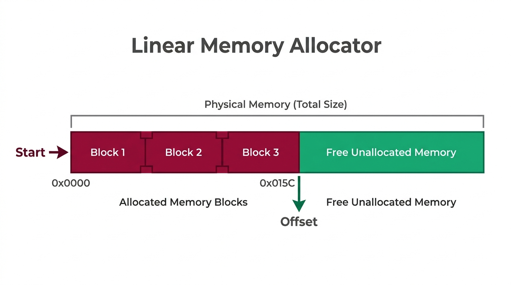

#### Allocation
Bumps the offset forward by the requested size (plus alignment padding).

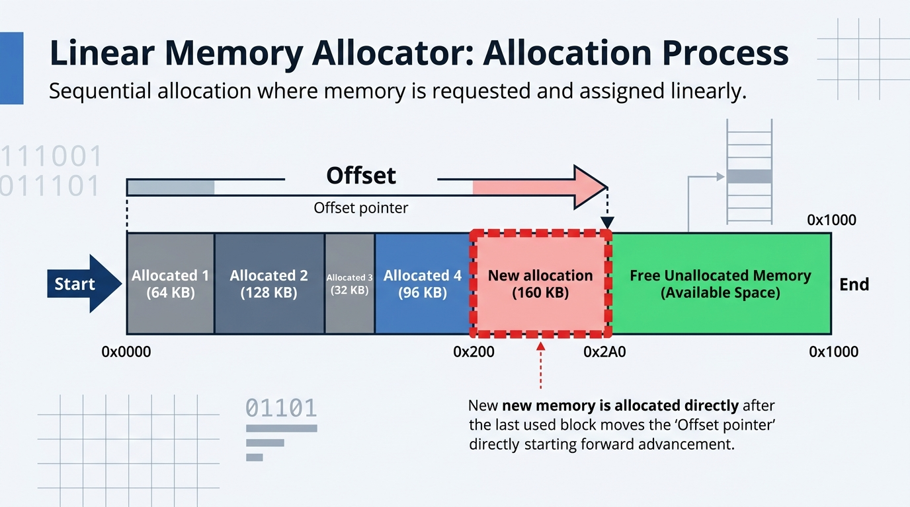

- **Allocation Complexity:** $O(1)$
- **Free Complexity:** Individual blocks cannot be freed. The entire arena is cleared simultaneously in $O(1)$ via `clear()`.

---

### Stack Allocator

A LIFO (Last-In, First-Out) allocator. Similar to the Linear Allocator, but supports rolling back allocations in reverse order.

#### Data Structure
Tracks the top of the stack with an offset pointer. Each allocation includes a small preceding header to store block metadata and alignment adjustments.

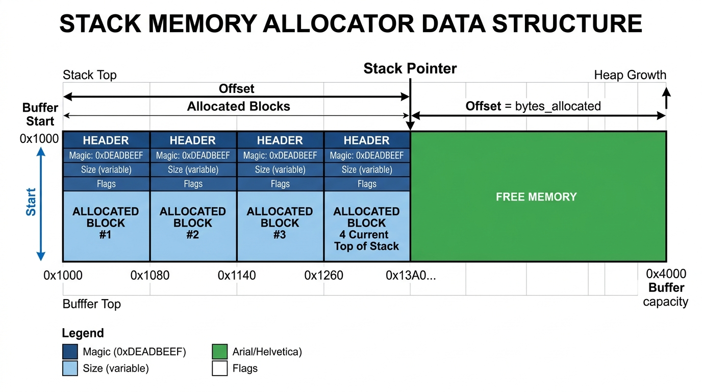

- **Space Complexity:** $O(N \cdot H) \to O(N)$ (where $H$ is header size and $N$ is allocation count).

#### Allocation
Advances the offset pointer and writes an allocation header immediately before the returned payload.

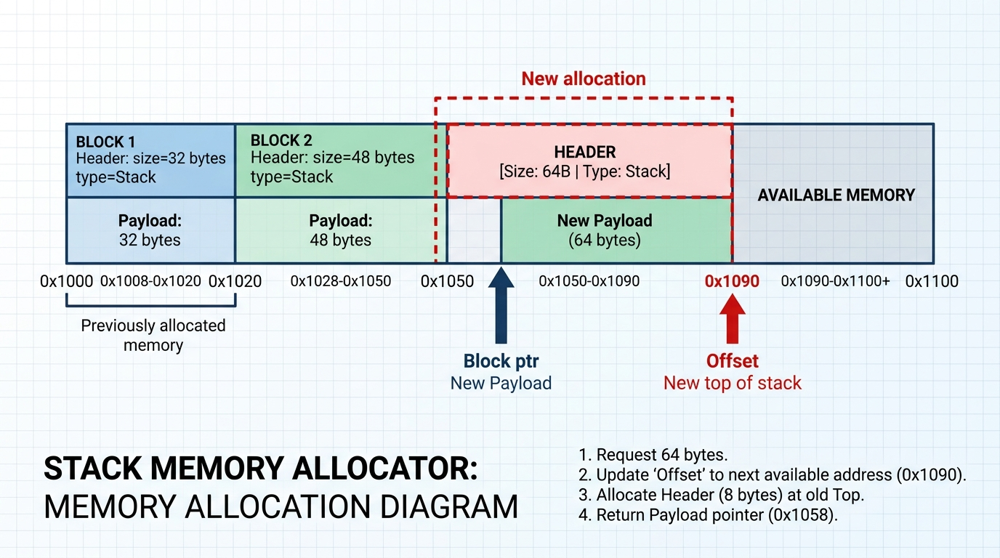

- **Allocation Complexity:** $O(1)$

#### Free
Rolls the offset pointer back to the previous allocation boundary using the metadata recorded in the header.

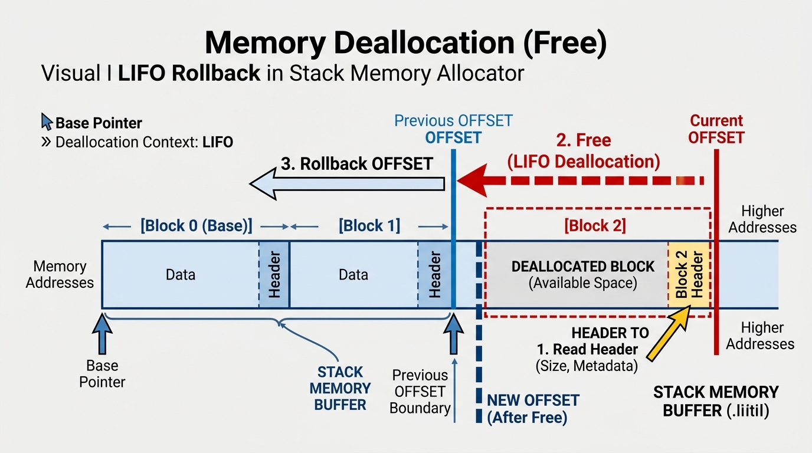

- **Free Complexity:** $O(1)$

---

### Pool Allocator

Partitions a contiguous memory arena into equal, fixed-size chunks. It is ideal for allocating large numbers of identical objects without fragmentation.

#### Data Structure & Intrusive Free List
The allocator maintains a singly linked list connecting all available chunks. To achieve zero external memory overhead, the pointers (`NEXT`) are stored **inside the free chunks themselves** (intrusive list).

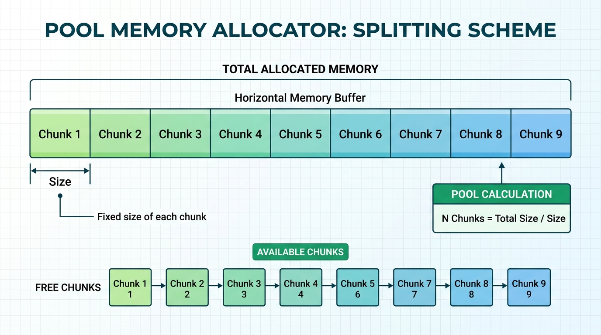
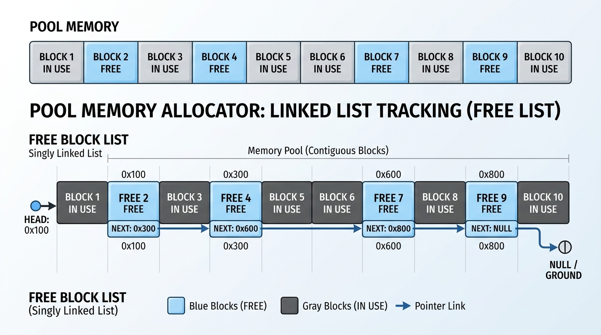
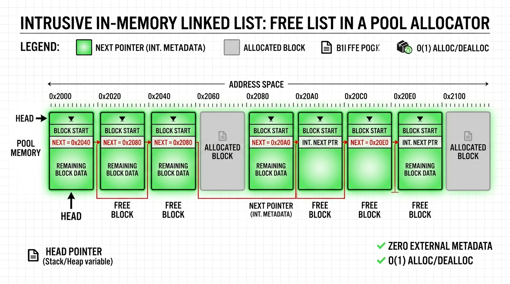

> **Constraint:** Each chunk must be at least as large as a pointer (`sizeof(void*)`, typically 8 bytes) to house the intrusive `NEXT` address.

#### Allocation
Pops the first free block from the head of the free list.

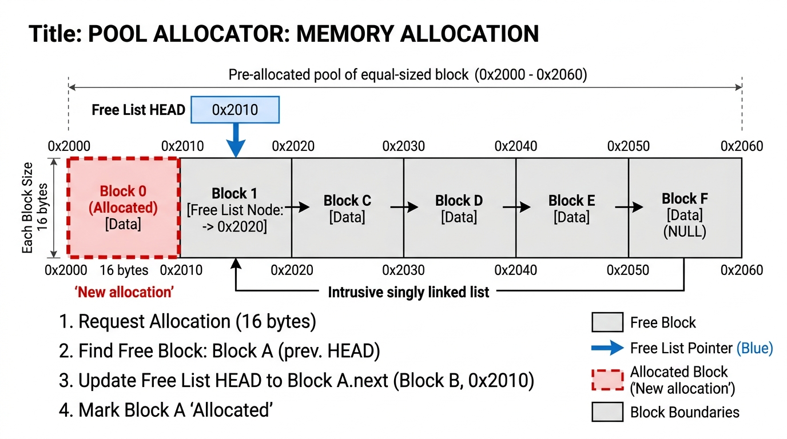

- **Allocation Complexity:** $O(1)$

#### Free
Pushes the freed block back onto the head of the intrusive free list. The free list order adapts dynamically based on deallocation patterns.

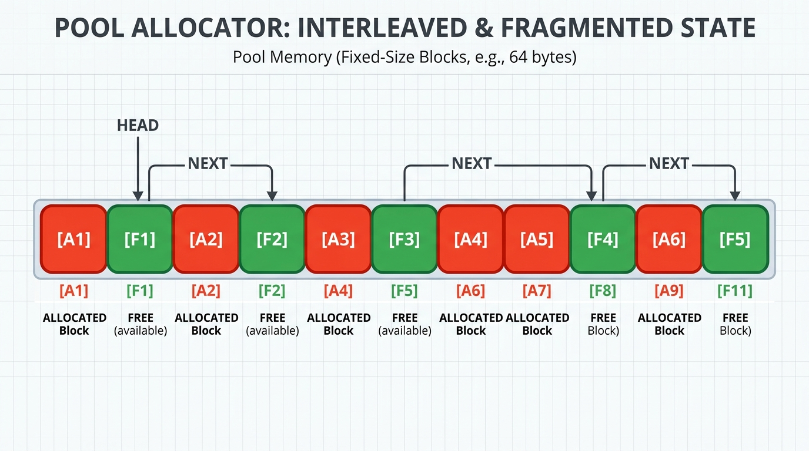

- **Free Complexity:** $O(1)$

---

### Free List Allocator

A general-purpose allocator with no constraints on allocation order, deallocation order, or block sizes.

#### Sequential Linked List Implementation
Maintains an address-sorted linked list of all free contiguous blocks. Each allocated block is prefixed with an allocation header to track size and alignment.

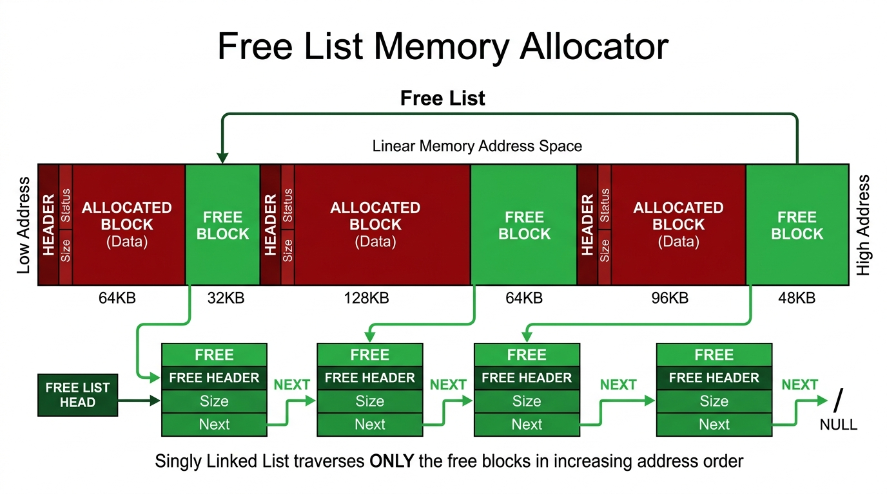

- **Space Complexity:** $O(N \cdot H_F + M \cdot H_A) \to O(M)$ ($H_F$ = free header size, $H_A$ = allocated header size).

#### Allocation (First-Fit & Best-Fit)
Traverses the free list for a block that satisfies the requested size:
- **First-Fit:** Selects the first sufficient block ($O(N)$ average time).
- **Best-Fit:** Searches all free blocks to find the smallest suitable match, minimizing fragmentation at the expense of search latency.
The selected block is split, returning the requested portion and retaining the remainder in the free list.

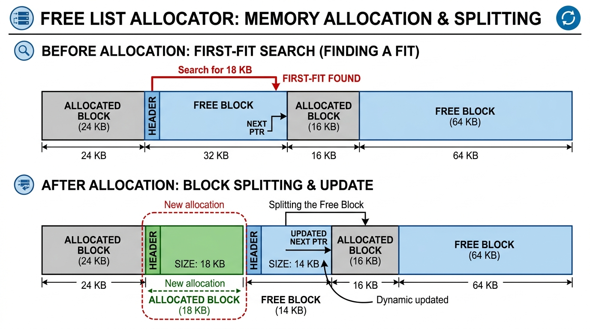

- **Allocation Complexity:** $O(N)$ (where $N$ is the number of free blocks).

#### Free & Coalescence
The freed block is re-inserted into the address-sorted free list. If adjacent blocks are also free, they are immediately merged (**coalesced**) in $O(1)$ into a single larger block, preventing memory fragmentation.

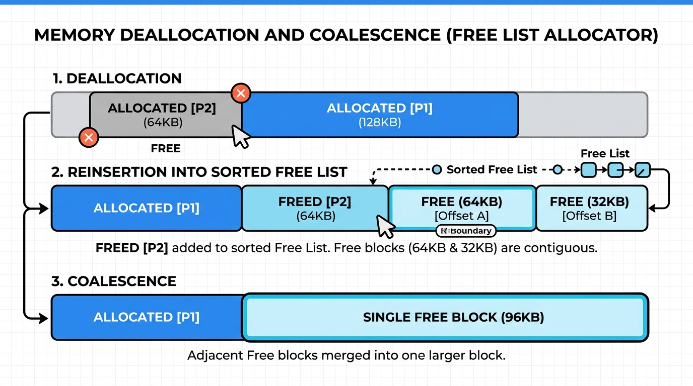

- **Free Complexity:** $O(N)$ search + $O(1)$ merge.

#### Red-Black Tree Optimization
By organizing free blocks in a Red-Black Tree keyed by size, search complexity drops from $O(N)$ to $O(\log N)$ while supporting efficient Best-Fit allocation. An auxiliary address-sorted doubly linked list enables $O(1)$ coalescence.

---

## Benchmarks

Benchmarked across varying allocation counts (up to 1,000,000 operations) with a fixed block size of 4,096 bytes.

### Time Complexity

#### 1. Total Time (Including Arena Initialization)
Measures the duration from `Init()` (initial arena allocation and structure setup) through the completion of all operations.

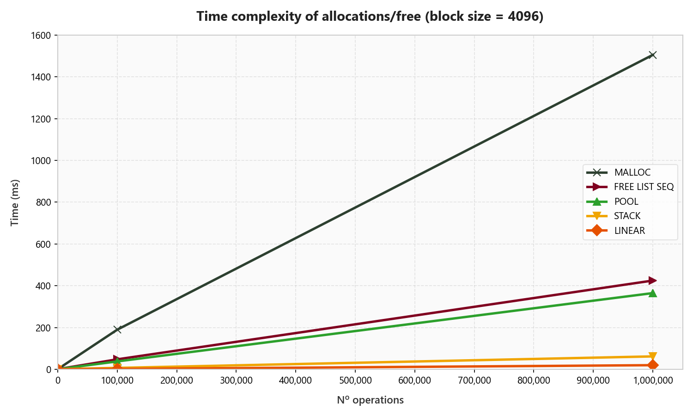

- **`malloc`:** Worst performance by a wide margin (~1500 ms at 1M ops) due to syscalls and general-purpose bookkeeping.
- **Free List:** ~3.5x faster than `malloc` (~425 ms).
- **Pool & Stack:** Display a linear setup slope during `Init()`, after which operational speed is near-instantaneous.

#### 2. Runtime Time (Excluding Initialization)
Isolates pure allocation and deallocation throughput after the arena has been initialized.

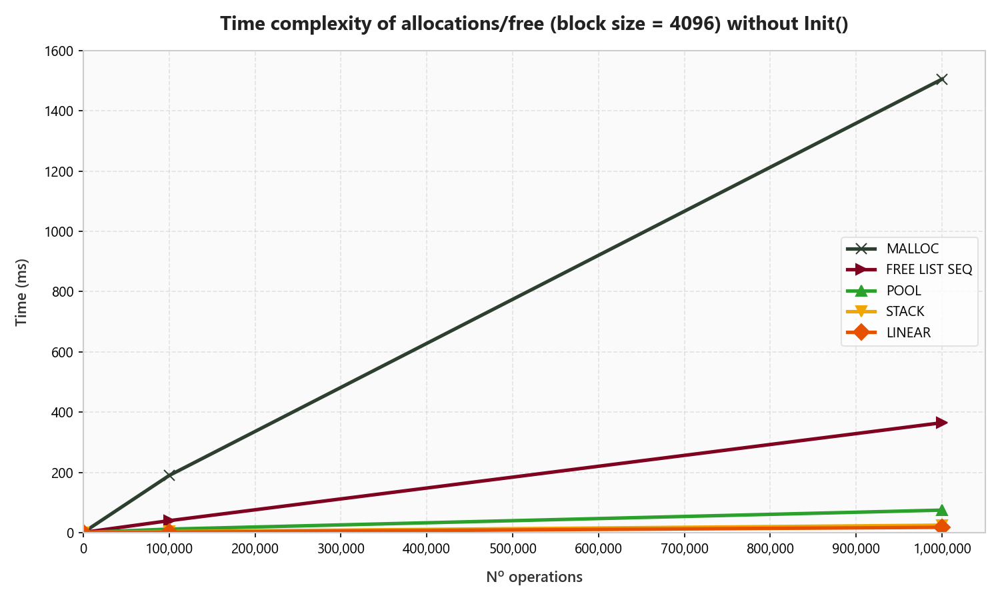

- **Linear (~18 ms), Stack (~25 ms), and Pool (~75 ms):** Exhibit true constant-time $O(1)$ performance.
- **Free List (~365 ms) & `malloc` (~1500 ms):** Scale linearly $O(N)$ with operation count.

---

### Space Complexity

Total memory footprint across operations:

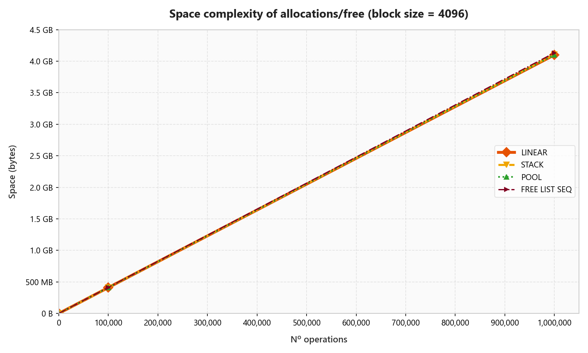

All allocators exhibit identical $O(N)$ asymptotic space complexity (~4.1 GB for 1,000,000 blocks of 4 KB). Constant overheads (headers, alignment padding) are negligible compared to total payload volume at scale.

---

## Usage Guide: Choosing the Right Allocator

```
Does data follow a specific lifetime or structure?
├── Yes
│   ├── All allocations freed together? ───────────────► Linear Allocator (Fastest, O(1))
│   ├── Allocations freed in reverse order (LIFO)? ────► Stack Allocator (O(1))
│   └── All allocations share identical size? ─────────► Pool Allocator (O(1), zero fragmentation)
└── No
    └── Arbitrary sizes and lifetimes? ────────────────► Free List Allocator (or system malloc)
```

- **Use Linear Allocator** for per-frame scratchpads, temporary level loads, or one-shot command buffers where everything is discarded simultaneously.
- **Use Stack Allocator** for nested execution contexts, recursive algorithms, or scoped allocations.
- **Use Pool Allocator** for high-frequency identical objects: game entities, particle systems, physics colliders, or network packets.
- **Use Free List Allocator** when allocation sizes and lifespans vary unpredictably, but `malloc` overhead is unacceptable.

---

## Future Work

- [ ] **Headerless 8-byte Alignment:** Optimize all allocators assuming natural 8-byte alignment to eliminate per-block headers.
- [ ] **Red-Black Tree Free List:** Implement the $O(\log N)$ balanced-tree free list.
- [ ] **Buddy Allocator:** Power-of-two partitioning for efficient variable-size allocation with low fragmentation.
- [ ] **Slab Allocator:** Cache-friendly kernel-style object caching.
- [ ] **Cache Miss Profiling:** Hardware-level cache hit/miss benchmarking using Linux `perf`.
